# Proyecto de E-commerce de Joyas 💎

Este es un proyecto de aplicación móvil desarrollado con React Native y Expo, diseñado para un emprendimiento personal de venta de joyas. La aplicación permite a los usuarios explorar y comprar joyas de manera sencilla.


## Tecnologías y Librerías Utilizadas 🚀

- **React Native**: Framework para construir aplicaciones móviles nativas utilizando JavaScript y React.
- **Expo**: Conjunto de herramientas y servicios para el desarrollo rápido de aplicaciones móviles con React Native.
- **NodeJs**: Entorno de ejecución multiplataforma de código abierto basado en javascript que nos permite crear aplicaciones escalables y ejecutar código del lado del servidor.
- **Redux**: Librería para manejar el estado global de la aplicación de forma predecible y consistente.
- **RTK Query**: Herramienta para realizar solicitudes de datos de manera eficiente y simplificar el manejo del estado de las solicitudes en aplicaciones Redux.
- **React Navigation**: Sistema de navegación para gestionar la navegación entre pantallas de la aplicación de manera fluida.
- **Expo Image Picker**: Permite a los usuarios seleccionar imágenes de la galería o tomar fotos con la cámara, útil para la carga de fotos de productos.
- **Expo Font**: Una biblioteca que permite cargar fuentes en tiempo de ejecución y usarlas en componentes React Native.
- **Yup**: Biblioteca para la validación de datos de formularios, asegurando que la información introducida por los usuarios sea correcta.
- **Firebase Autenticación**: Servicio que proporciona una solución de autenticación fácil de implementar, permitiendo a los usuarios registrarse e iniciar sesión utilizando correo electrónico, redes sociales, y más.
- **Firebase Realtime Database**: Base de datos NoSQL en tiempo real que permite la sincronización de datos instantánea entre clientes y el servidor, ideal para aplicaciones que requieren actualizaciones en tiempo real.
- **Expo-sqlite**: Sistema de gestión de bases de datos relacional ligero integrado en el dispositivo, utilizado para el almacenamiento local de datos en la aplicación.

## Instalación 🛠️

1. Clona el repositorio:

    ```bash
    git clone https://github.com/tuusuario/nombre-del-repo.git
    ```

2. Navega al directorio del proyecto:

    ```bash
    cd nombre-del-repo
    ```

3. Instala las dependencias:

    ```bash
    npm install
    ```

4. Inicia el servidor de desarrollo:

    ```bash
    npm start
    ```

## Funcionalidades ✨

- **Exploración de Productos**: Navega a través de una lista de categorías de joyas disponibles.
- **Detalles del Producto**: Visualiza imagen,  características y precio de cada joya.
- **Carrito de Compra**: permite comprar los productos del carrito, generando una Orden de Compra.
- **Listado de Ordenes**: visualiza todas las ordenes y los detalles de las mismas.
- **Selección de Imágen**: Permite a los usuarios subir una imágen en el perfil tomando una foto desde la camara o seleccionandola desde la biblioteca. Tambien puede cargar y modificar  algunos datos personales.
- **Validación de Ingreso y registro**: Asegura que todos los datos del usuario sean correctos tanto en el login como en el registro de usuario.

## Notas Adicionales 📝

Este proyecto no incluye una pasarela de pago. La funcionalidad de compra está limitada a la visualización y selección de productos para su compra.
Tambien incluye el cambio de modo oscuro a claro, pero no queda registrado en la preferencia del usuario.

## Pantallas de la APP Login y Registro 📸
<kbd>
    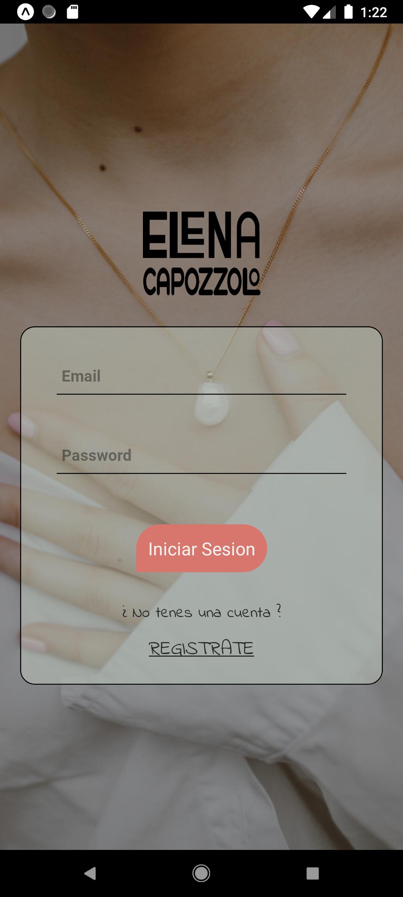
    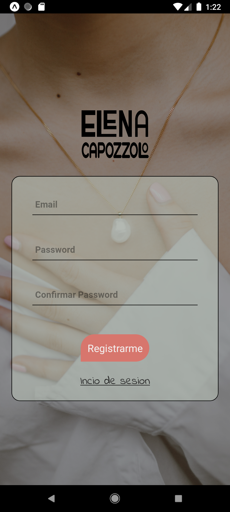
</kbd>


## Pantallas de la APP Modo Light 📸
<kbd>
    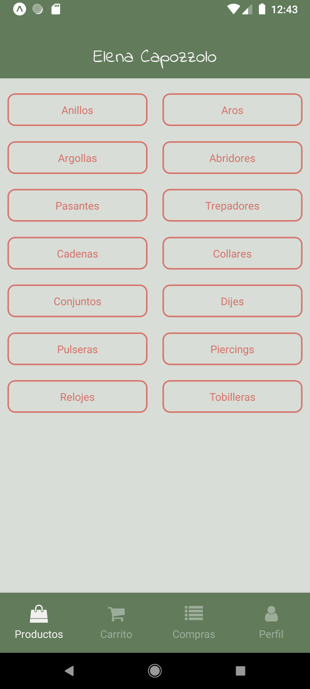
    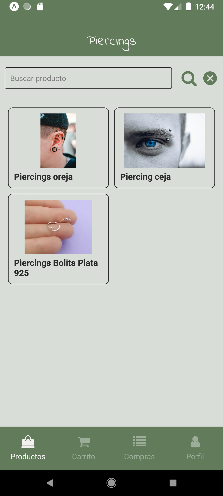
    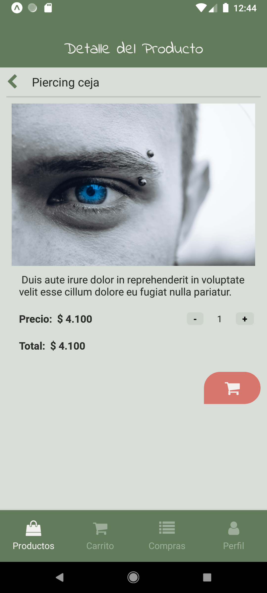
    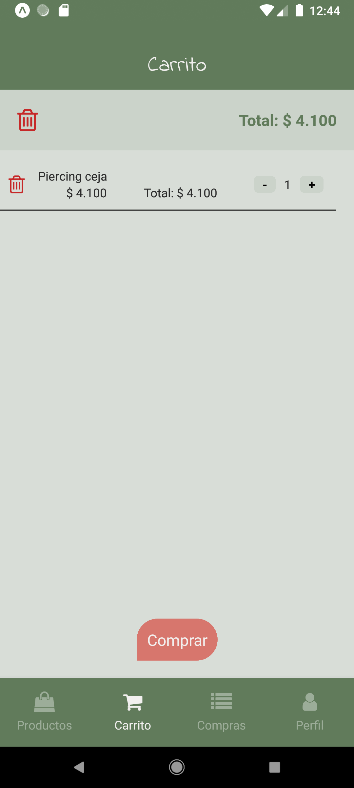
    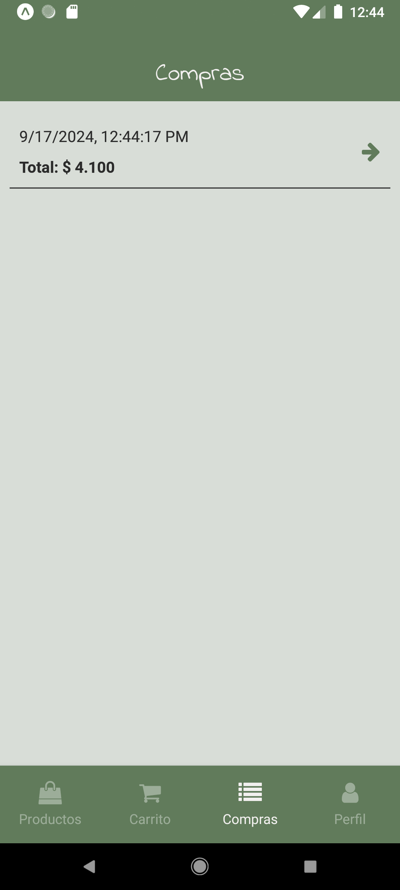
    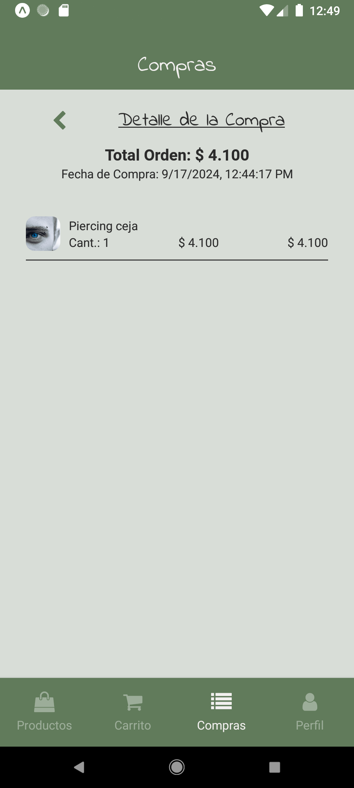
    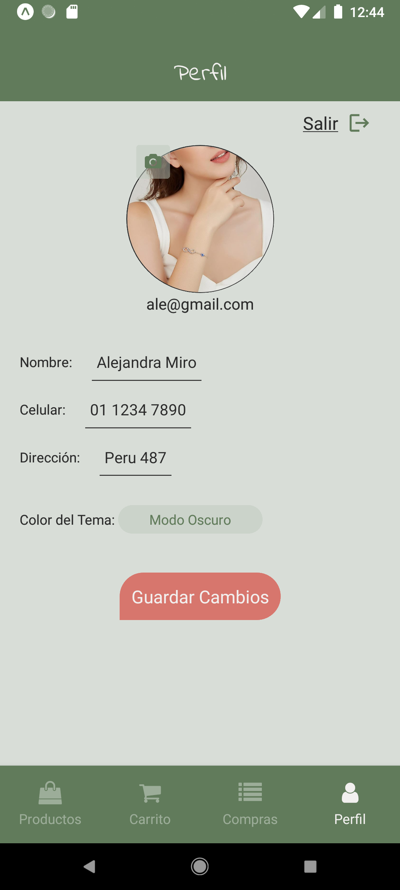
    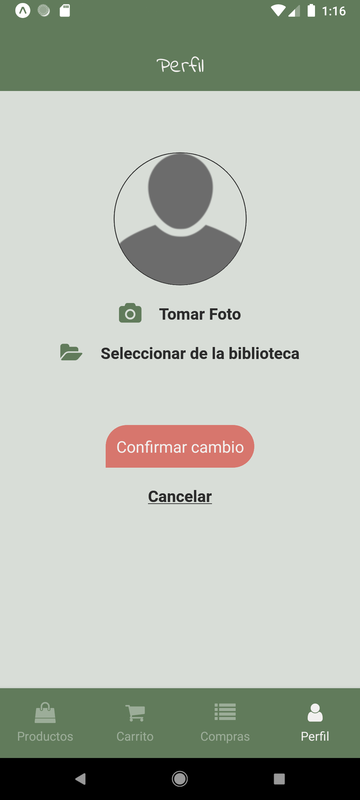
</kbd>

## Pantallas de la APP Modo Dark 📸
<kbd>
    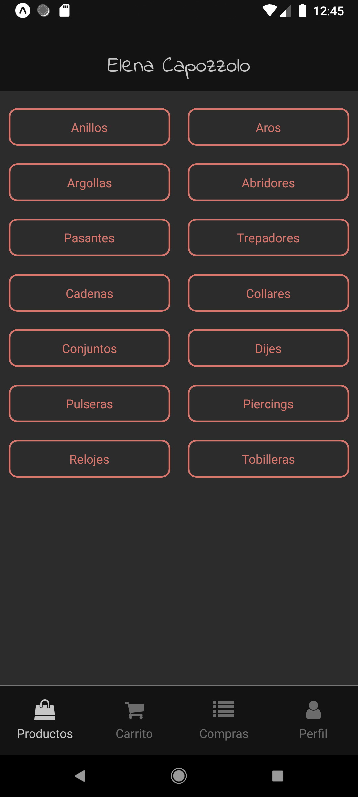
    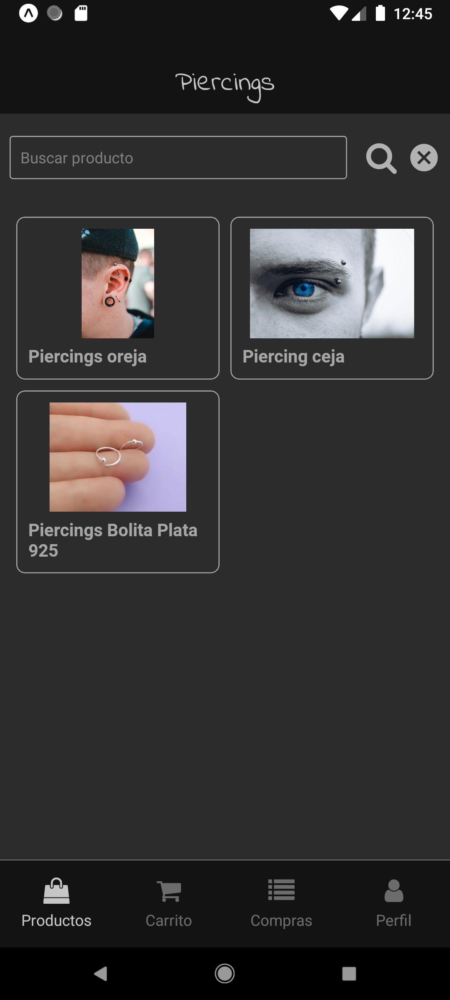
    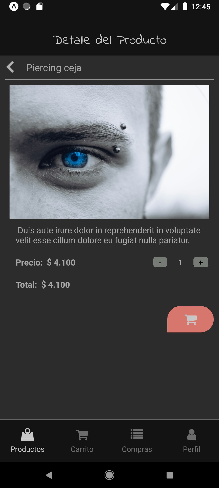
    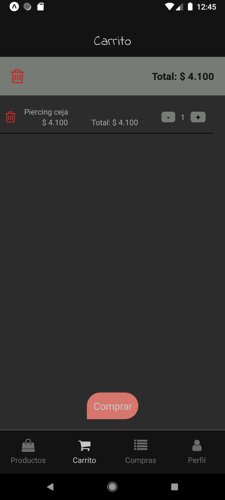
    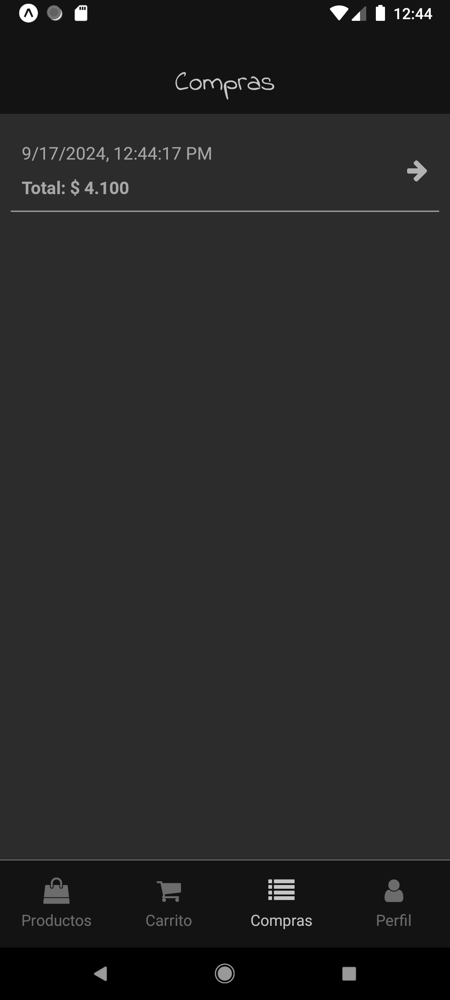
    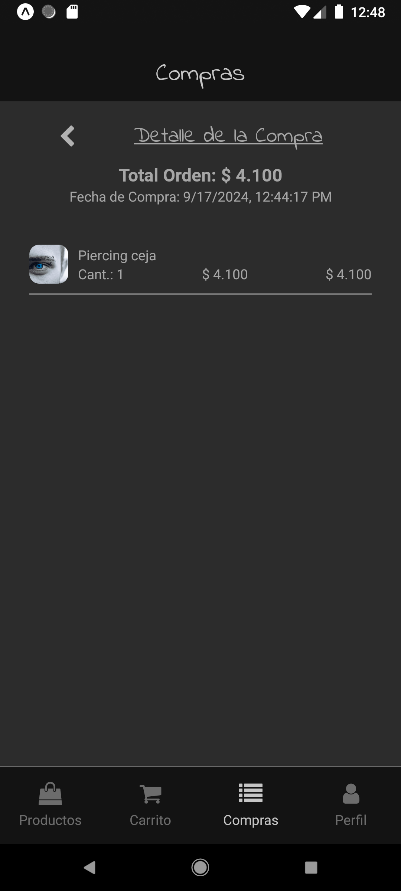
    
    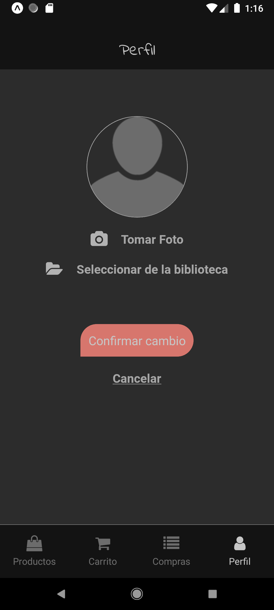
</kbd>


## Documentacion y enlaces que puedes consultar 📕 🔗

[React Native](https://reactnative.dev/) - 
[Expo](https://docs.expo.dev/) - 
[RTK Query](https://redux-toolkit.js.org/) - 
[Redux](https://redux.js.org/) -
[Firebase](https://firebase.google.com/?hl=es) -
[SQLite](https://docs.expo.dev/versions/latest/sdk/sqlite/)


# 👋 😉

